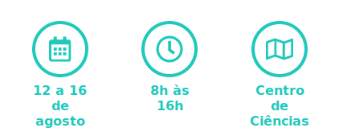

# XIV Semana Acadêmica da Computação

Repositório de desenvolvimento do site da XIV Semana Acadêmica da Computação.

## O que é a SAC?

Criada em 2006, a Semana Acadêmica da Computação, mais conhecida como SAC, é um evento de extensão do Departamento de Computação da Universidade Federal do Ceará, organizada anualmente pelo PET Computação. Suas atividades se extendem do auditório do Centro de Ciências, no bloco 902, aos laboratórios do Departamento de Computação, no bloco 910.

	

## Executando

Para executar o projeto, basta baixá-lo para sua máquina e então abrir o arquivo index.html no seu navegador favorito.

## Contribuindo

Para contribuir com o projeto, siga a lista abaixo:

1. Dê `fork` no projeto.
2. Baixe o projeto para a sua máquina digitando em seu terminal `git clone <url-projeto>`.
3. Crie um branch com `git checkout -b <nome-branch>`.
4. Faça as alterações.
5. Commite e dê `git push` para o repositório "forkado".
6. Crie um Pull Request e espere a nossa aprovação :heart:.